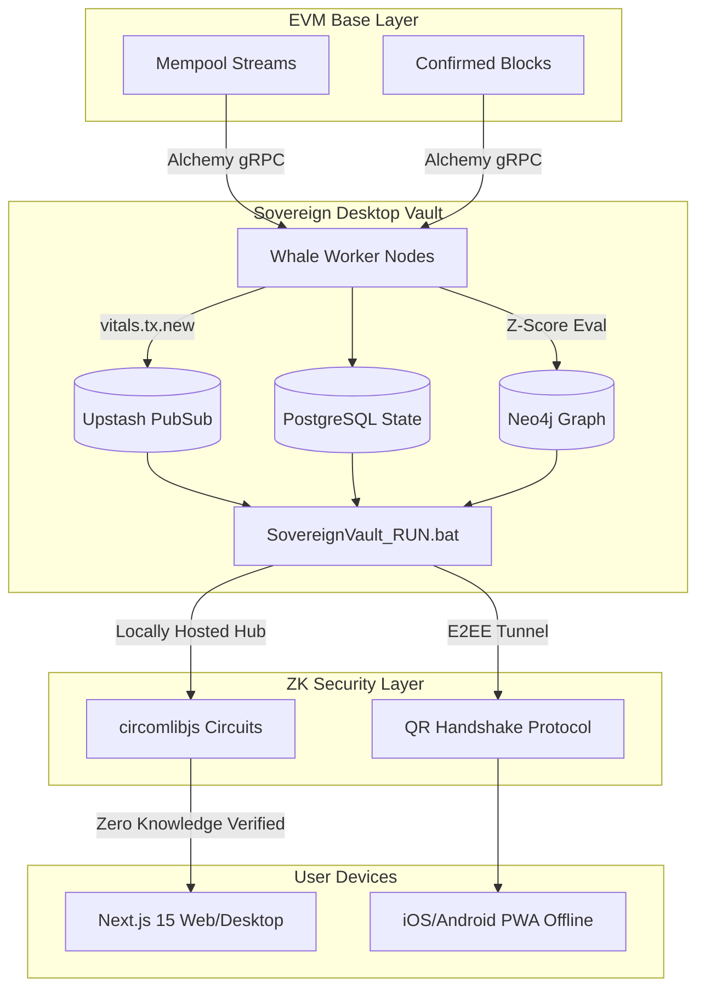

# WHALE ALERT PORTAL: MASTER ARCHITECTURE 👁️⚡️
"Bringing real-time on-chain data to an elite-grade standard. Optical fiber speed, resilient nodes, and maximum fidelity."

This document serves as the absolute blueprint and master photograph of the Whale Alert Portal architecture, built on an uncompromising "Legendary Level" standard.

---

## 🏛️ 1. MACRO-ARCHITECTURE OVERVIEW
The Whale Alert Portal is not merely a wallet; it is a **High-Frequency On-Chain Intelligence Terminal**. It fuses Zero-Knowledge identity verification (WorldID), real-time Ethereum/Base mempool telemetry, predictive markets (Polymarket), and elite-grade portfolio analytics into a single seamless interface.

### Topology Matrix

### 🧠 State & Persistence Layer
- **PostgreSQL - Prisma ORM**: Primary relational store for user profiles, identity mappings, and transaction metadata.
- **MongoDB - Mongoose**: Dynamic storage for Polymarket event data and complex market indices.
- **Redis / Upstash (PubSub & Cache)**:
  - **Zero-Crash Safeguard**: Implements a "Degraded Mode" mock client if `REDIS_URL` is unavailable.
  - **PubSub**: Facilitates real-time event broadcasting from workers to the WebSocket gateway.
  - **Caching**: 10-minute TTL on heavy Intelligence Reports and portfolio snapshots.

### ⛓️ Blockchain & Protocol Layer
- **Base & ETH RPCs**: Leveraging Alchemy, Infura, and official public nodes.
- **ResilientProvider**: Custom fail-over logic with circuit breakers across 4+ RPC endpoints for 100% uptime.
- **WorldCoin IDKit**: ZK-SNARK based identity proofs for sybil-resistant human verification.
- **Moralis Deep Indexing**: High-speed retrieval of historical cross-chain transaction data.

### 🐋 Background Engine / Scanners (The Whale Engine)
- **EVM Whale Scanner**: Dedicated long-running process scanning mempools and new blocks for high-value movement.
- **BTC Mempool Scanner**: Real-time monitoring of Bitcoin unconfirmed transactions.
- **Telegram Alert Bot**: Automated notification delivery via dedicated worker.
- **Alchemy Monitoring**: Subscribes to `alchemy_pendingTransactions` for elite addresses (e.g., vitalik.eth).

---

## ⚡ 2. CELESTIAL GATEWAY (Node.js + WebSockets)
**Technology:** Custom Node.js server ([server.ts](file:///c:/Users/admin/.gemini/antigravity/scratch/Wallet%20Human%20Polymarket%20ID/server.ts)) wrapping Next.js 15.

- **Unified Hub:** Handles HTTP requests and WebSocket connections (`Socket.io`) on a single port (3000).
- **Resilience Standard:** Implements dynamic internal imports and mock-fallbacks to prevent startup crashes (ECONNREFUSED protection).
- **Socket Event Pipeline:**
  1. `AlchemyMonitor` detects mempool activity.
  2. Event published to Redis channel `vitals.tx.new`.
  3. WebSocket Hub broadcasts JSON payload to authenticated clients with **sub-100ms latency**.

---

## 🧠 3. THE INTELLIGENCE SERVICE (Deep Analytics)
**Technology:** [IntelligenceService.ts](file:///c:/Users/admin/.gemini/antigravity/scratch/Wallet%20Human%20Polymarket%20ID/lib/blockchain/IntelligenceService.ts)

Generates "Pentagon-level" address profiles by merging Moralis deep-indexing with real-time Ethers.js data.

### Key Metrics Tracked:
- **Active Age & Streaks**: Precise calculation of wallet longevity and daily activity consistency.
- **365-Day Heatmaps**: Visual intensity mapping of on-chain interactions.
- **Elite Neighbors**: Net inflow/outflow analysis identifying top counterparty relationships.
- **dApp Sentiment**: Protocol-level volume tracking and interaction frequency.
- **AI Forensics**: Automated risk signaling and behavior profiling via GPT-powered analysis.

---

## 🌐 4. CLIENT TERMINAL (Frontend UX/UI)
**Technology:** Next.js 15 App Router + Tailwind CSS + Framer Motion.

### Aesthetics: "Legendary Level" Cyberpunk-Glassmorphism
- **LiquidPrismBackground**: Advanced WebGL-simulated shaders creating a premium, living interface depth.
- **PaperPortfolioView**: Real-time table rendering reacting instantly to `vitals.tx.new` socket events with smooth entry animations.
- **Data Fidelity**: Zero-polling architecture; the UI reflects the blockchain state the moment it hits the mempool.

---

## 🛡️ 5. THE "LEGENDARY LEVEL" FIXES (Integrity Standard)
The architecture is fortified against critical failure vectors:

1. **OOM Immunity**: Node memory expanded to 8GB (`--max-old-space-size=8192`) for heavy AST parsing.
2. **Web3 Dependency Isolation**: Webpack configuration excludes mobile-native SDKs (`@react-native-async-storage`, `porto`) from browser bundles.
3. **Zero-Crash Redis**: The application detects Redis connection issues at boot and enters "Degraded Mode" rather than failing, ensuring the UI remains accessible even if the cache layer is down.
4. **RPC Circuit Breaker**: If an RPC endpoint (like Alchemy) returns 429 or 5xx, the system automatically rotates to the next healthy provider in the `ResilientProvider` pool.

**[System Status: LEGENDARY. Protocol Active.]**
