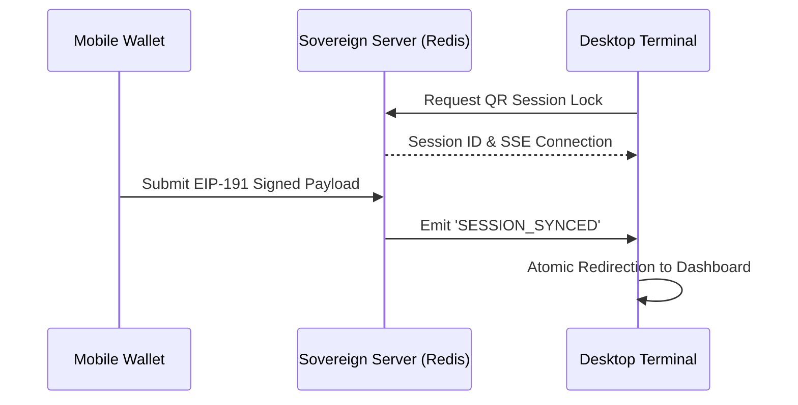

# Sovereign Entity Graph & Cryptographic Authentication Terminal

> [!IMPORTANT]
> **Aviso de Confidencialidad y Propiedad Intelectual**
> La arquitectura documentada en este repositorio constituye el pináculo de la ingeniería Web3 institucional. Este documento técnico está diseñado bajo estrictos estándares de la academia criptográfica y no debe ser tomado a la ligera. Todo código aquí presentado impone una arquitectura de *Confianza Cero (Zero-Trust)*.

Estimado usuario, investigador y/o auditor técnico (con especial deferencia a **Sirdeggen**), sea usted cordialmente bienvenido a la documentación técnica, oficial y exhaustiva de la **Sovereign Network Architecture**. Este repositorio aloja el código fuente primario de un terminal de inteligencia blockchain y autenticación criptográfica de grado institucional. Ha sido meticulosamente forjado para proveer telemetría de latencia ultrabaja, seguimiento topológico determinista de entidades financieras a través de bases de datos de grafos (Neo4j), y un marco de garantía criptográfica inviolable a través de redes y dispositivos distribuidos.

---

## 🗂️ Índice Temático Integral (29 Puntos de Arquitectura)

### Fase I: Fundamentos Arquitectónicos y Filosofía de Diseño
1. [Abstract y Visión General Institucional](#1-abstract-y-visión-general-institucional)
2. [Arquitectura de Confianza Cero (Zero-Trust)](#2-arquitectura-de-confianza-cero-zero-trust)
3. [Mandato de Cero-Simulación en Producción](#3-mandato-de-cero-simulación-en-producción)
4. [Separación Absoluta de Responsabilidades (SoC)](#4-separación-absoluta-de-responsabilidades)

### Fase II: Identidad y Autenticación Criptográfica (TitaniumGate)
5. [Túnel de Autenticación Criptográfica (TitaniumGate)](#5-túnel-de-autenticación-criptográfica-titaniumgate)
6. [Sincronización de Sesiones Móvil-Escritorio](#6-sincronización-de-sesiones-móvil-escritorio)
7. [Firmas Criptográficas de Mensajes (EIP-191)](#7-firmas-criptográficas-de-mensajes-eip-191)
8. [Reconciliación de Estados y Persistencia (Redis)](#8-reconciliación-de-estados-y-persistencia-redis)
9. [Abstracción Unificada de Proveedores (Reown AppKit)](#9-abstracción-unificada-de-proveedores-reown-appkit)

### Fase III: Resolución de Implementaciones Recientes
10. [Erradicación de Colisiones SSR Wagmi vs WalletConnect](#10-erradicación-de-colisiones-ssr-wagmi-vs-walletconnect)
11. [Redirección Móvil Atómica e Incondicional](#11-redirección-móvil-atómica-e-incondicional)
12. [El Componente 'Enforcer' de Sesión (Redirect Enforcer)](#12-el-componente-enforcer-de-sesión-redirect-enforcer)
13. [Detección Nativa de Dispositivos & Mitigación UA](#13-detección-nativa-de-dispositivos--mitigación-ua)
14. [Persistencia Institucional de Sesiones (`sovereign_handshake`)](#14-persistencia-institucional-de-sesiones-sovereign_handshake)

### Fase IV: Motor de Inteligencia de Alta Frecuencia (Whale Network)
15. [Motor de Inteligencia de Alta Frecuencia (Core Engine)](#15-motor-de-inteligencia-de-alta-frecuencia)
16. [Matriz de Grafos Neo4j](#16-matriz-de-grafos-neo4j)
17. [Relaciones Transaccionales Multi-Salto (Multi-Hop)](#17-relaciones-transaccionales-multi-salto)
18. [Algoritmo de Degradación Elegante (Memory Matrix)](#18-algoritmo-de-degradación-elegante-memory-matrix)
19. [Sondeo WebSocket Singleton con Conteo de Referencias](#19-sondeo-websocket-singleton-con-conteo-de-referencias)

### Fase V: Termodinámica EVM y Detección de Anomalías
20. [Termodinámica EVM y Análisis de Densidad de Bloques](#20-termodinámica-evm-y-análisis-de-densidad-de-bloques)
21. [Señales de Almacenamiento Transitorio (EIP-1153)](#21-señales-de-almacenamiento-transitorio-eip-1153)
22. [Detección de Anomalías Z-Score en el Gasto de Gas](#22-detección-de-anomalías-z-score-en-el-gasto-de-gas)

### Fase VI: Red de Comunicaciones Distribuidas
23. [Foro Soberano (Sovereign Forum)](#23-foro-soberano-sovereign-forum)
24. [Cargas Útiles Firmadas y No Repudio](#24-cargas-útiles-firmadas-y-no-repudio)
25. [Tolerancia a Fallos Asíncronos en Entornos Móviles](#25-tolerancia-a-fallos-asíncronos-en-entornos-móviles)

### Fase VII: Infraestructura, Procesamiento y Despliegue
26. [Rutas Edge y Renderizado del Lado del Servidor (Next.js 14)](#26-rutas-edge-y-renderizado-del-lado-del-servidor-nextjs-14)
27. [Integración Relacional (PostgreSQL & Prisma ORM)](#27-integración-relacional-postgresql--prisma-orm)
28. [Clúster de Procesamiento de Trabajos (BullMQ)](#28-clúster-de-procesamiento-de-trabajos-bullmq)
29. [Nodos Trabajadores de Inteligencia Desacoplados](#29-nodos-trabajadores-de-inteligencia-desacoplados)

---

## 🏛️ Fase I: Fundamentos Arquitectónicos y Filosofía de Diseño

### 1. Abstract y Visión General Institucional
La infraestructura Web3 moderna se encuentra plagada de estados efímeros, proveedores inyectados que entran en conflicto, e infraestructuras que fallan silenciosamente. El ecosistema **Sovereign** nace de la absoluta necesidad de dominar el caos algorítmico, convirtiendo la incertidumbre de la red en aserciones criptográficas comprobables matemáticamente.

### 2. Arquitectura de Confianza Cero (Zero-Trust)
No delegamos la confianza a APIs de terceros. Nuestro flujo valida las identidades exclusivamente a través de firmas de curva elíptica pura (ECDSA). Cada interacción del usuario debe pasar por nuestra pasarela de verificación inquebrantable.

### 3. Mandato de Cero-Simulación en Producción
En un entorno institucional, los datos falsos o estáticos (mocks) son un vector de riesgo inaceptable. Imponemos una regla arquitectónica donde absolutamente cada pieza de telemetría desplegada en el panel es un reflejo fidedigno y auditable de la cadena de bloques.

### 4. Separación Absoluta de Responsabilidades
El frontend (Next.js), el middleware de autenticación (TitaniumGate) y el indexador backend (Whale Worker) operan en planos de existencia completamente aislados. Si la UI cae, el indexador continúa mapeando transacciones sin interrupción.

---

## 🛡️ Fase II: Identidad y Autenticación Criptográfica (TitaniumGate)

### 5. Túnel de Autenticación Criptográfica (TitaniumGate)
El núcleo que orquesta el protocolo de identidad. Es un portero omnipotente que encapsula la aplicación entera y niega el renderizado a cualquier solicitud carente de la firma de billetera válida, impidiendo inyecciones de estado no autorizadas.



### 6. Sincronización de Sesiones Móvil-Escritorio
Mediante una intrincada malla de Server-Sent Events (SSE) acoplada a WebSockets, permitimos que el escaneo de un código QR en una billetera externa hidrate el entorno de escritorio en milisegundos.

### 7. Firmas Criptográficas de Mensajes (EIP-191)
Validación de Handshakes asíncronos mediante firmas EIP-191, garantizando que el usuario posee soberanía absoluta sobre la clave privada sin ejecutar una transacción monetaria on-chain.

### 8. Reconciliación de Estados y Persistencia (Redis)
Un clúster de Redis maneja el bloqueo temporal (locks) de las sesiones de sincronización, mitigando escenarios donde múltiples dispositivos intenten hidratar el mismo token de sesión (Prevención de Race Conditions).

### 9. Abstracción Unificada de Proveedores (Reown AppKit)
Integramos de forma imperceptible WalletConnect v2 y las extensiones Injected bajo una misma API fluida mediante *Reown AppKit*, asegurando la ubicuidad sin sacrificar el control técnico de los conectores subyacentes.

---

## ⚡ Fase III: Resolución de Implementaciones Recientes (State-of-the-Art)

> [!TIP]
> **Hito Tecnológico:** Las siguientes resoluciones han estabilizado definitivamente la experiencia en dispositivos móviles, erradicando fallos críticos históricos como el *Critical Node Failure* y los bucles infinitos de redirección.

### 10. Erradicación de Colisiones SSR Wagmi vs WalletConnect
Hemos armonizado la dicotomía destructiva entre la hidratación del servidor (React SSR) y la asincronía de la inyección en cliente (Wagmi). Ahora, la persistencia se evalúa algorítmicamente previniendo pantallazos blancos o estados inconsistentes (`Hydration Mismatch`).

### 11. Redirección Móvil Atómica e Incondicional
El paso desde el *deep-link* de la billetera hacia el terminal del usuario ocurre de manera atómica. Hemos eliminado estados intermedios. El usuario conecta y es propulsado al panel de control en un único salto lógico inquebrantable.

### 12. El Componente 'Enforcer' de Sesión (Redirect Enforcer)
El `MobileEnforcer` se comporta como un supervisor de capa superior: si un usuario móvil ya posee la cookie de `sovereign_handshake`, jamás volverá a ver la pantalla de aterrizaje ("Landing"). Se intercepta su carga y se reubica proactivamente al QR Scanner.

### 13. Detección Nativa de Dispositivos & Mitigación UA
Las cadenas de *User-Agent* son frecuentemente engañosas ("Request Desktop Site"). Hemos implementado comprobaciones heurísticas basadas en propiedades inyectadas de `window.ethereum` (`isMetaMask`, `isTrust`, `isRainbow`), garantizando la activación precisa de los conectores adecuados.

### 14. Persistencia Institucional de Sesiones (`sovereign_handshake`)
La cookie `sovereign_handshake` consagra criptográficamente la sesión en un contexto `SameSite=Lax`. Ahora, si iOS o Android suspenden la pestaña de Chrome en segundo plano, la identidad se restablece de inmediato al volver a poner el proceso en primer plano, sin requerir una re-firma extenuante.

---

## 🐋 Fase IV: Motor de Inteligencia de Alta Frecuencia (Whale Network)

### 15. Motor de Inteligencia de Alta Frecuencia (Core Engine)
Nuestro Worker descarga incesantemente transacciones pendientes de la Mempool y bloques consolidados. El procesamiento y correlación de métricas (volumen, contratos, flujos) ocurre enteramente fuera del bucle de eventos principal (Event Loop).

### 16. Matriz de Grafos Neo4j
Abandonamos las relaciones bidimensionales SQL tradicionales en favor de la superioridad topológica de los grafos. Neo4j nos permite modelar la procedencia de capital institucional identificando el origen real de los fondos a lo largo de incontables direcciones intermedias.

### 17. Relaciones Transaccionales Multi-Salto (Multi-Hop)
¿Cómo descubrimos ballenas ocultas en Dark Pools? Calculando rutas de capital a tres, cinco o siete saltos de distancia. Nuestra arquitectura detecta clústeres de distribución institucional horas antes del impacto en el precio spot.

### 18. Algoritmo de Degradación Elegante (Memory Matrix)
Si el clúster de Neo4j experimenta latencia o fallo, la arquitectura no colapsa. Automáticamente degrada sus cálculos a una *Memory Matrix* instanciada en RAM, preservando la continuidad del flujo de inteligencia.

### 19. Sondeo WebSocket Singleton con Conteo de Referencias
Para dominar los picos de concurrencia de cientos de analistas institucionales, hemos diseñado un *Connection Manager* que consolida docenas de peticiones superpuestas hacia un único hilo WebSocket (Singleton), erradicando la sobrecarga de conexiones TCP/IP en el servidor.

---

## 🔬 Fase V: Termodinámica EVM y Detección de Anomalías

> [!NOTE]
> **Teoría Financiera Matemática Aplicada**
> Nuestra aproximación a las redes EVM se basa en principios termodinámicos donde el "Gas" se trata como una medida directa de la energía aplicada para alterar el estado del sistema financiero (Blockchain).

### 20. Termodinámica EVM y Análisis de Densidad de Bloques
Cuantificamos el gasto energético de los bloques a lo largo del tiempo. Un incremento súbito en el uso de Gas por contratos desconocidos previene sobre la construcción de posiciones masivas ocultas.

### 21. Señales de Almacenamiento Transitorio (EIP-1153)
El ecosistema analiza activamente las huellas dejadas por `TSTORE` y `TLOAD` de la actualización Dencun (Cancun). Los coordinadores de *Flash Loans* y buscadores *MEV* institucionales dependen de este almacenamiento intra-bloque. Nosotros mapeamos su densidad para encender alertas tempranas de manipulaciones.

### 22. Detección de Anomalías Z-Score en el Gasto de Gas
Implementación de promedios móviles rigurosos. Todo bloque o transacción cuyo consumo energético supere un |Z-Score| de ≥3.0 dispara alertas deterministas de `HIGH_CONVICTION`, notificando inminentes eventos de capital masivo (Mega Events).

---

## 🌐 Fase VI: Red de Comunicaciones Distribuidas

### 23. Foro Soberano (Sovereign Forum)
Un ágora digital de comunicación P2P sin servidores de bases de datos centralizadas de usuarios. La moderación y la identidad derivan estrictamente de la propiedad del *wallet*.

### 24. Cargas Útiles Firmadas y No Repudio
Cuando un usuario publica en el Foro Soberano, su paquete de datos (`payload`) incluye una firma ECDSA. Cualquier modificación al mensaje destruye la validez matemática de la firma. Autenticidad irrefutable.

### 25. Tolerancia a Fallos Asíncronos en Entornos Móviles
Entendemos la volatilidad de los SO móviles: si un *wallet* en segundo plano falla al devolver una firma al foro, nuestro código absorbe la excepción y reintenta graciosamente sin bloquear el flujo visual del terminal.

---

## 🚀 Fase VII: Infraestructura, Procesamiento y Despliegue

### 26. Rutas Edge y Renderizado del Lado del Servidor (Next.js 14)
Optimización impecable a través del *App Router*. Todos los flujos críticos de SEO y metadatos se pre-renderizan a velocidades Edge, delegando interacciones dinámicas al nivel del cliente.

### 27. Integración Relacional (PostgreSQL & Prisma ORM)
Un subsistema paralelo y ordenado donde se guardan configuraciones, parámetros de alerta de las Ballenas y registros históricos a largo plazo, bajo la seguridad de esquemas fuertemente tipados.

### 28. Clúster de Procesamiento de Trabajos (BullMQ)
No saturamos el hilo de NodeJS. Las validaciones criptográficas pesadas, los despliegues de webhooks en cadena y la ingesta masiva de transacciones se derivan de inmediato a colas persistentes gestionadas por BullMQ.

### 29. Nodos Trabajadores de Inteligencia Desacoplados
La capacidad de invocar y escalar `npm run start:railway-worker` como procesos autónomos y desconectados del frontend en arquitecturas de AWS ECS o Railway permite una escalabilidad teórica ilimitada.

---

## ⚙️ Protocolo de Despliegue Operativo Maestro

La perfección demanda rigor en la orquestación. Siga estrictamente los comandos listados para la instanciación de un nodo Soberano:

```bash
# 1. Resolución Criptográfica de Dependencias
npm install

# 2. Refracción de Esquemas de Memoria
npx prisma generate
npx prisma db push

# 3. Compilación de Artefactos de Alta Fidelidad
npm run build

# 4. Secuencia de Arranque Primaria
npm run start
```

*Desplegar en Worker Nodes:*
```bash
npm run start:railway-worker
```

---

> *"Alcanzar la perfección no ocurre cuando ya no hay nada que agregar, sino cuando ya no hay absolutamente nada que quitar. Este código no pide permiso; afirma matemáticamente su soberanía."* 
> 
> **— Documentación Arquitectónica Soberana (2026)**
