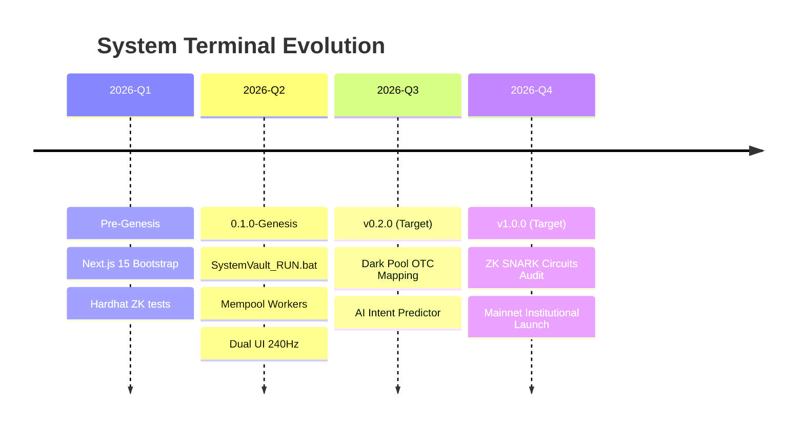

# Release Integrity Grid

This node maintains absolute accountability for deployed systems iterations along the Genesis timeline. 

## [Version 0.1.0] - Genesis Vault Protocol
**Codename**: "Leviathan Submersion"
**Date**: Currently in Deployment Window

### Visual Version History

### Baseline Integrity Signatures
- **Frontend Core**: Next.js App Router (v15+)
- **System Engine**: Local `SystemVault` execution pipeline
- **Analytics Nodes**: Neo4j, Prisma, Upstash Redis clusters
- **Cryptographic Engine**: Aztec Network ZK Integrations, Hardhat VM

### Architectural Directives Fulfilled
The `0.1.0` iteration was designed strictly to eradicate external proxy reliance. By relocating critical deterministic analysis to the user's local daemon (`SystemVault_RUN.bat`), we established a Zero-Trust perimeter. The system processes direct Mempool RPC feeds and utilizes BullMQ logic for parallel execution without cloud bottlenecking.

### Expected Rollouts
- **v0.2.0**: Native Dark Pool OTC mapping via deterministic WebGL terrain.
- **v1.0.0**: Fully audited ZK SNARK circuits deployed on Ethereum Mainnet.
